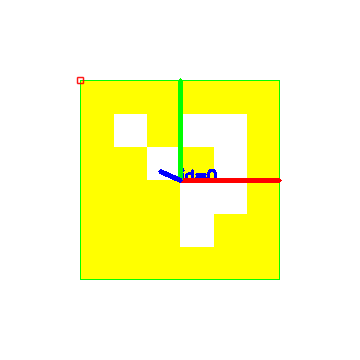

# aruco-localizer

ArUco marker detection + pose estimation for mobile robot localization.

I built this to get a clean vision → pose → telemetry pipeline before wiring it into an ESP32 rover. No ROS bag, no sim — just OpenCV, a webcam, and JSON output a controller can actually read.

## What it does

- Detects ArUco markers in a camera frame or image
- Estimates marker pose relative to the camera (translation + yaw)
- Streams telemetry: marker id, corner pixels, pose vector, detection confidence proxy
- Saves annotated frames for quick debugging

## Output example

Detected marker id 0 with pose axes drawn:



## Quick start

```bash
python -m venv .venv
.venv\Scripts\activate
pip install -r requirements.txt

# run on a still image (works without webcam)
python scripts/run_image.py --image data/sample_marker.png

# run live webcam
python scripts/run_camera.py --camera 0
```

Example output:

```json
{
  "markers": [
    {
      "id": 0,
      "tvec_mm": [12.4, -8.1, 245.0],
      "yaw_deg": -3.2,
      "corners": [[120, 88], [210, 90], [208, 178], [118, 176]]
    }
  ]
}
```

## Why ArUco

Fiducial markers are boring but reliable. For indoor robots, ArUco gives you centimeter-level pose without training a model or fighting lighting like color blob tracking.

**What I learned:** smaller markers drop detection range fast. I keep IDs 0–9 for the floor map and print at 10cm minimum.

## Layout

```
src/
  detector.py    # marker detection
  pose.py        # pose from camera intrinsics
  pipeline.py    # frame → telemetry
scripts/
  run_camera.py
  run_image.py
tests/
  test_detector.py
```

## Stack

Python 3.11 · OpenCV · NumPy · pytest

## Roadmap

- [ ] UART bridge to ESP32
- [ ] Multi-marker map fusion
- [ ] ROS2 node wrapper

## Related repos

- [rag-eval-bench](https://github.com/vedantrazjpurohit-create/rag-eval-bench) — retrieval evaluation harness
- [rag-api](https://github.com/vedantrazjpurohit-create/rag-api) — HTTP layer over the same retrieval stack
- [student-crud-c](https://github.com/vedantrazjpurohit-create/student-crud-c) — C fundamentals practice